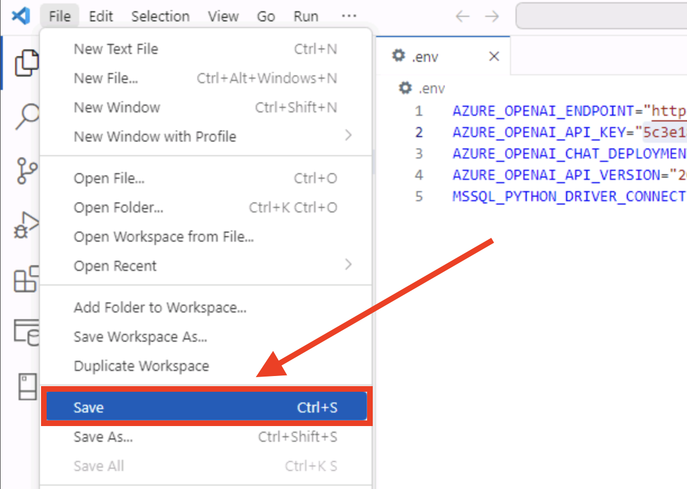
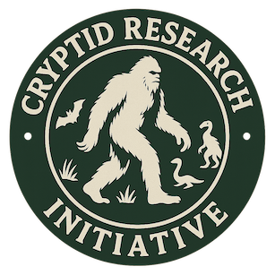

# Welcome to Lab 365: Build new AI applications with Azure SQL Database - Azure SQL Edition

# 1. Connect to the free Azure SQL Database with Visual Studio Code

## **Using Visual Studio Code**

Visual Studio Code will be used for working with the database.

1. Launch **Visual Studio Code**.

1. When Visual Studio Code opens, click the **SQL Extension** on the left side.

    

1. Next, click **Add Connection** in the SQL Extension. *(The Add Connection option might take a few seconds to appear.)*

    

1. A SQL **Connection Dialog** tab will appear in the VS Code editor.

    

1. Next, for **Input type**, select the **Browse Azure** radio button.

    

1. A Visual Studio Code dialog box will now pop up stating **The extension 'SQL Server (mssql)' wants to sign in using Microsoft.**. Click the **Allow** button. 

    

1. On the **Sign in** dialog window

	

    use your Azure Portal username in the Email, phone, or Skype field:

    

1. Then, click the **blue Next button** after the username has been entered

	

1. On the next step/dialog box, use the **password field** and enter your password:

    

1. Then, click the **blue Sign in button** after the password has been entered

    

1. You will be then asked if you would like to **Automatically sign in to all desktop apps and websites on this device?**. Click the **blue Yes, all apps button**.
 
	

1. After signing you into all apps, click the **blue Done button** in the **You're all set!** dialog box.

	

1. Back in the SQL **Connection Dialog** tab, 

	

    find the **Database dropdown** and select **SampleDB**.

	

1. Next, use the following dropdown called **Authentication type** and select **Microsoft Entra ID - Universal with MFA support**

	

1. Once selected, a **Sign in button** will be available. Click the **Sign in button**.

	

1. A **browser page** will appear asking you to **Pick an account**. Select your account that you want to use by clicking on it.

	
	
1. On the **mssql for Visual Studio Code** page, you will get confirmation that **Your account was added successfully!** and that **You may now close this page.**

	

1. Close the page by **closing the tab** by clicking the X on the tab in the browser

	

    and then minimize the browser by **clicking the minimize button** on the right upper side.

	

1. Back in the SQL **Connection Dialog** tab, click the **blue Connect button** on the lower right side.

	

1. You are now **connected** to the **Azure SQL Database**!

	

1. **Right click** on the database name in the **SQL Extension** and select **New Query** 
	
	
    
    to create a new query editor.

	
	
# 2. Azure AI Content Understanding

Azure AI Content Understanding is a new Generative AI based Azure AI Service, designed to process/ingest content of any types (documents, images, videos, and audio) into a user-defined output format. We will be using it in this lab to analyze a video and have it return data fields we can insert into a database table.

## Call REST services from the Azure SQL Database with External REST Endpoint Invocation

But before we do, we need to understand how we are going to interact with the REST services that Azure AI Content Understanding provides.

### External REST Endpoint Invocation

Azure SQL Database External REST Endpoint Invocation provides the ability to call REST endpoints from other Azure services such as OpenAI, Azure Event Hub, Azure Functions, Power BI and more. Common use cases for developers to use External REST Endpoint Invocation are:

* Utilize Azure OpenAI services such as chat, embeddings, language, and content safety
* Ability to push business logic out of the database and into Azure Functions
* Pull/push data to/from external sources (including Azure Blob Storage) for ETL or derived data stores
* Participate in event-based architectures with Azure Event Hub or Kafka

External REST Endpoint Invocation can be called in an Azure SQL Database using the sp_invoke_external_rest_endpoint stored procedure.

## Azure AI Content Understanding, REST, and the Azure SQL Database

In this section, you will use the External REST Endpoint Invocation (EREI) feature of the database to analyze a video using Azure AI Content Understanding. Step one is to create the analyzer with a user-defined output format. Next, we provide it with a video we have staged in Azure Storage. Once the video is analyzed, we can then take the user-defined output format and insert it into our database table. 

This section will also create a database scoped credential. A database scoped credential is a record in the database that contains authentication information for connecting to a resource outside the database. For this lab, we will be creating one for connecting to Azure OpenAI services and one for connecting to Azure AI Content Understanding.

## Creating the CryptozoologyVideos table

The first step in our quest for cryptid relevancy is to create a table to store our research. This table is going to need to track the results of our video analysis as well as previous videos that we received from fellow cryptozoologists around the world. 

1. Using the new query sheet in VS Code, **copy and paste** the following code to create our table:

	A few notes about our table. First, we limit a few of the values we can use in the **Time of Day** and **Threat Level** columns by using table constraints. These constraints will able be used with Azure AI Content Understanding. We are also using the IDENTITY property for VideoID that will create identity column in our table as well as act as our primary key.

    ```SQL
    CREATE TABLE [dbo].[CryptozoologyVideos]  
    (  
        VideoID INT IDENTITY(1,1) PRIMARY KEY,  
        CryptidName      VARCHAR(100) NOT NULL,  
        TimeOfDay        VARCHAR(100),       -- Will enforce certain allowed values  
        Location         VARCHAR(2000),  
        Weather          VARCHAR(2000),  
        VideoSetting     VARCHAR(2000),  
        VideoDescription VARCHAR(MAX),  
        CryptidLore      VARCHAR(MAX),
        ThreatLevel      VARCHAR(50),       -- Will enforce certain allowed values 
        CONSTRAINT CK_TimeOfDay CHECK  
        (  
            TimeOfDay IN  
            (  
                'Morning','Afternoon','Evening','Night',  
                'Dusk','Dawn','Midday','Late Night','Twilight',  
                'Late Afternoon','Early Morning','Midnight','Noon','Early Evening'  
            )  
        ),
        CONSTRAINT CK_ThreatLevel CHECK  
        (  
            ThreatLevel IN  
            (  
                'High','Medium','Low'  
            )  
        )  
    );  
    GO  
	```

1. Then **click the run/Execute Query button** on the query sheet

	

1. Now that the table is created, copy and paste the following code into a blank query sheet. You can also remove the previous code by **highlighting it and pressing delete/backspace**.

	```SQL
    INSERT INTO [dbo].[CryptozoologyVideos]  (CryptidName,  TimeOfDay,  Location,  Weather,  VideoSetting,  VideoDescription,  CryptidLore,  ThreatLevel)
    VALUES
    ('Bigfoot', 'Dusk', 'Pacific Northwest, USA', 'Rainy', 'Mist-filled old growth forest','A towering, dark figure emerges between the trees. It pauses, staring in the direction of the camera, before slowly advancing, forcing the videographer to retreat in fear.','Bigfoot, also called Sasquatch, is a bipedal, primate-like cryptid reported in North America, especially in the Pacific Northwest. Described as standing 7-10 feet tall and covered in dark hair, it leaves large humanlike footprints and is known for its elusiveness, wood knocking, and howls. Evidence includes tracks and disputed images, with explanations ranging from misidentification to folklore and hoaxes.','Medium'),
    ('Chupacabra', 'Night', 'Chihuahua, Mexico', 'Windy', 'Open pasture with scattered livestock','The camera shakes as a hunched, spined creature darts towards the videographer, letting out a guttural hiss and causing them to run for safety as livestock panic behind them.','The Chupacabra is a blood-sucking cryptid originating from Puerto Rico, later reported across the Americas. Typically described as a 3-4 foot reptilian creature with spines, glowing eyes, and fangs, or sometimes a mangy canid. It is infamous for livestock deaths with bloodless wounds. Scientific studies often identify such Chupacabras as coyotes with mange.','High'),
    ('Loch Ness Monster', 'Morning', 'Loch Ness, Scotland', 'Foggy', 'Calm lake surface','A long, dark shape undulates through the misty water as startled boaters film, but the animal remains distant and avoids approaching.','The Loch Ness Monster, or Nessie, is a legendary aquatic cryptid said to inhabit Loch Ness, Scotland. It is often described as having a long neck with several humps above the surface, and dates back to 6th-century stories. Despite many sightings and some photos, scientific evidence is lacking, and theories range from misidentified animals to floating logs.','Low'),
    ('Mokele-Mbembe', 'Noon', 'Likouala Swamps, Republic of the Congo', 'Sultry, overcast', 'Murky river bend, thick jungle','A massive, long-necked creature surges from the swamp, charging toward the boat. Water splashes over the camera as guides scream and the image cuts out.','Mokele-Mbembe is a legendary semi-aquatic animal from Congo folklore, believed by some to resemble a sauropod dinosaur. Sightings describe an elephant-sized creature with a long neck and tail, living in dense swamps and rivers. While expeditions have found tantalizing clues, no scientific evidence for its existence has been confirmed.','High'),
    ('Mothman', 'Evening', 'Point Pleasant, West Virginia', 'Cloudy', 'Abandoned TNT factory','A winged, red-eyed figure lands on a nearby structure, then soars straight toward the camera operator, whose panicked breath and retreat are audible as the creature dives overhead.','Mothman is a winged humanoid cryptid first reported in West Virginia in 1966. Typically described as tall, with a 10-foot wingspan, dark body, and glowing red eyes, Mothman appearances are sometimes linked to disasters. Theories include misidentified sandhill cranes, mass hysteria, or paranormal explanations.','High'),
    ('Jersey Devil', 'Late Night', 'Pine Barrens, New Jersey, USA', 'Foggy', 'Twisted forest, moonlit','Filming in the dark woods, the videographer is confronted by a shrieking, winged beast that crashes through tree limbs above, then swoops low and drives them to run for their life.','The Jersey Devil is a flying cryptid reported in New Jersey''s Pine Barrens for over 200 years. Descriptions include a kangaroo-like body, bat wings, horses head, horns, and a piercing cry. Explanations range from folklore and misidentification to hoaxes, yet the legend persists in regional culture.','High'),
    ('Bunyip', 'Afternoon', 'Billabong, New South Wales, Australia', 'Thunderstorm', 'Reedy floodplain pond','A dark, tusked head lunges from the water, emitting a thunderous bellow that causes the videographer to drop the camera and flee, splashing through the mud.','The Bunyip is an aquatic cryptid from Australian Aboriginal and colonial settler lore, said to lurk in swamps, creeks, and billabongs. Features vary, including tusks, flippers, or shaggy fur, but all tales agree on its loud roar and frightening aspect. Explanations suggest seals, large mammals, or misidentifications.','High'),
    ('Ahool', 'Early Evening', 'Java Rainforest, Indonesia', 'Humid', 'Twilight over dense jungle canopy','A huge, bat-like animal swoops down, its massive wings nearly hitting the camera as branches snap above the videographer, forcing them to dive for cover.','The Ahool is a giant bat-like cryptid from Java''s rainforests. Reports describe a 10-12-foot wingspan, monkey-like face, and nocturnal habits. Some researchers suspect rare large bats or birds are behind sightings, while others consider the Ahool a localized legend representing the mysterious nature of the deep jungle.','High'),
    ('Loveland Frogman', 'Night', 'Loveland, Ohio, USA', 'Drizzling rain', 'Bridge over riverbank','A green, amphibian creature emerges onto the road. The videographer freezes as the being glares with reflective eyes, then leaps toward the camera before vanishing in the river.','The Loveland Frogman is a bipedal amphibious cryptid from Ohio, described as roughly 3-4 feet tall and frog- or lizard-like. Noteworthy sightings occurred in 1955 and the 1970s. Some propose misidentified animals or hoaxes, yet stories remain part of Ohio folklore.','Medium'),
    ('Thunderbird', 'Midday', 'Great Plains, USA', 'Storm approaching', 'Wide open prairie','A gigantic shadow crosses overhead as a massive bird circles, its powerful screech startling livestock and the camera holder alike.','The Thunderbird is a legendary bird-like cryptid in Native American lore, especially in the Pacific Northwest and Great Plains. Sightings report creatures with wingspans broad enough to carry large prey. Explanations include large raptor species or folklore rooted in natural spectacle.','Medium'),
    ('Beast of Bray Road', 'Night', 'Elkhorn, Wisconsin, USA', 'Heavy fog', 'Deserted rural road','A hulking, wolf-like creature stands upright in the headlights, then lets out a guttural snarl and charges the vehicle, slamming against the door as the engine starts in panic.','The Beast of Bray Road is a werewolf-like cryptid reported from Wisconsin, described as a 6-foot-tall, bipedal wolf or dog-man. Sightings peaked in the 1980s and 1990s with reports of livestock attacks and aggressive behavior. Explanations include escaped animals, large wolves, or folklore.','High'),
    ('Skunk Ape', 'Afternoon', 'Everglades, Florida, USA', 'Hot and humid', 'Dense cypress swamp','A foul stench is followed by rustling, then a hairy figure bursts from the brush toward the camera, forcing the operator to stumble back into deep water.','The Skunk Ape is a large, foul-smelling, ape-like cryptid from the swamps of the southeastern USA. Described as 5-7 feet tall, reddish-brown, and elusive, it is frequently reported by hunters and explorers. Evidence includes footprint casts and blurry photos; explanations range from misidentifications to deliberate hoaxes.','High'),
    ('Lake Champlain Monster', 'Morning', 'Lake Champlain, Vermont/New York, USA', 'Foggy', 'Quiet lake shore','A series of dark humps ripple the lake''s surface as the camera zooms in from the shore. The creature submerges just as shouting draws attention from nearby boaters.','Champ is a lake cryptid said to inhabit Lake Champlain in Vermont and New York. Most sightings describe a serpentine animal 20-40 feet long with a horse-like or reptilian head. Native legends and modern photos support its mystery, but scientific evidence is inconclusive.','Low'),
    ('Ogopogo', 'Dusk', 'Okanagan Lake, British Columbia, Canada', 'Clear', 'Lakeshore with distant mountains','A multi-humped shape glides past swimmers, who rush for shore as the creature''s large head rears up for a moment before sliding into deeper water.','Ogopogo is a lake cryptid from British Columbia, Canada, often described as a serpent-like animal with several humps, up to 50 feet long. The earliest legends come from the Syilx First Nation. Explanations include waves, otters, and logs, but reports continue to this day.','Medium'),
    ('Dover Demon', 'Late Night', 'Dover, Massachusetts, USA', 'Misty', 'Rural roadside with stone walls','A pale, spindly figure with glowing eyes crouches by the road. When the videographer approaches, it darts toward the camera, vanishing just as panic rises.','The Dover Demon is a thin, hairless cryptid with a large head and glowing eyes, sighted in Dover, Massachusetts in 1977. It moves both bipedally and on all fours. Some suggest a foal or escaped pet, but it remains unidentified in cryptozoology.','Medium'),
    ('Mapinguari', 'Afternoon', 'Amazon Rainforest, Brazil', 'Oppressive heat', 'Dense jungle','A massive, shaggy beast roars and charges directly at the camera, smashing bush as the operator falls while fleeing. The air fills with a nauseating stench.','Mapinguari is a giant, bipedal Amazonian cryptid described as a red-haired creature with fierce claws and a foul odor. Some believe it could be a surviving ground sloth. Indigenous and explorer accounts persist, though evidence remains elusive.','High'),
    ('Altamaha-ha', 'Morning', 'Altamaha River, Georgia, USA', 'Hazy', 'Wide, slow-moving river','A long, serpentine head surfaces close to the boat, glaring at the videographer before swiftly submerging, rocking the vessel and prompting panicked shouts.','Altamaha-ha is a river monster said to live in southeastern Georgia. Descriptions include a 20-30-foot-long, sturgeon-like animal with ridges and sometimes a seal-like face. Sightings span from Native legends to the modern day.','High'),
    ('Lizard Man', 'Night', 'Scape Ore Swamp, South Carolina, USA', 'Heavy rain', 'Backwoods muddy road','A tall, scaly bipedal figure grabs the car door with long claws, clawing and pressing against the glass as the driver screams and accelerates away.','The Lizard Man of Scape Ore Swamp is a reptilian cryptid with three-toed tracks, glowing eyes, and green scales, sighted in South Carolina since 1988. First encounters involved car damage. Theories include unknown lizards or misidentified animals.','High'),
    ('Flatwoods Monster', 'Evening', 'Flatwoods, West Virginia, USA', 'Clear after storm', 'Edge of woods near a farm','A towering, glowing figure hovers in the trees. A wave of heat and choking mist engulfs the camera as the videographer coughs and stumbles backward.','The Flatwoods Monster is a 10-foot, spade-headed entity with a metallic lower body, reported in West Virginia in 1952. Witnesses described acrid odors, hovering movement, and mechanical sounds. Explanations include barn owls, meteor sightings, and mass hysteria.','High'),
    ('Fresno Nightcrawler', 'Night', 'Fresno, California, USA', 'Clear', 'Suburban backyard captured by security camera','Surveillance footage captures two eerily walking, pale, legged figures gliding across the lawn, while the household dog growls and flees out of sight.','The Fresno Nightcrawler is a cryptid captured on CCTV in California, appearing as very tall white legs with small torsos and no arms. Theories include misidentified animals, puppetry, or new cryptid species. It has become popular due to viral videos.','Low'),
    ('Brosno Dragon', 'Morning', 'Lake Brosno, Russia', 'Overcast', 'Remote lake shore with mist','A dragon-like head erupts from the water near the shore, causing the camera operator to stumble and fall into the wet silt as others flee.','The Brosno Dragon is a lake monster from western Russia, described as a dragon or aquatic reptile up to 15 meters long. Myths date to medieval times, and stories mention drownings and attacks. Natural explanations include gas bubbles or large fish.','High'),
    ('Kushtaka', 'Morning', 'Southeastern Alaska, USA', 'Misty', 'Foggy riverbank near coastal forest','A humanoid with sleek, otter-like features appears in the mist. As the camera focuses, the creature mimics a human scream, causing the videographer to stagger away in terror.','The Kushtaka is a shapeshifting entity from Tlingit and Tsimshian tradition. It appears as part-otter, part-human, luring travelers astray and sometimes imitating cries for help. Some tales portray it as malicious, others as a spirit protector.','High'),
    ('Kappa', 'Midday', 'Shizuoka Prefecture, Japan', 'Light rain', 'Riparian pond in rural Japan','A squat, green humanoid with a turtle shell and water bowl atop its head approaches the camera, baring sharp teeth and lunging suddenly before the feed cuts out.','Kappa are Japanese river cryptids, child-sized water creatures with beaked faces, turtle shells, and a water dish on their skulls. Legends emphasize mischief and danger to humans and animals, but also honor given if one outwits them. Sightings may stem from turtles or aquatic mammals.','High'),
    ('Batsquatch', 'Afternoon', 'Mount St. Helens, Washington, USA', 'Cloudy', 'Clearing at edge of volcanic forest','A massive, furred creature with wolf features and huge bat wings descends from a tree, roaring at the camera, which shakes violently as the person flees.','Batsquatch is a blue-furred, winged cryptid reported after Mount St. Helens''s 1980 eruption. Most sightings involve a muscular, part-primate, part-bat figure. It is considered an unlikely but persistent legend in Pacific Northwest cryptozoology.','High'),
    ('Rougarou', 'Night', 'Louisiana bayou', 'Still and humid', 'Foggy cypress swamp','A bipedal, wolf-headed monster explodes from the shadows, howling and racing toward the camera operator, whose panicked shouts and stumbling footsteps echo as the feed becomes erratic.','The Rougarou is a werewolf-like entity from Cajun and French-American folklore in the Louisiana bayous. Described as a human body with a wolf head, it is linked to moral warnings and transformation myths, often used to frighten children and enforce social rules.','High'),
    ('Yowie', 'Dusk', 'Blue Mountains, New South Wales, Australia', 'Cool and misty', 'Gum forest clearing','A towering, hairy beast crashes through the underbrush, emitting bone-chilling screams that cause the camera operator to drop the device and flee as thudding footsteps close in.','Yowie is an Australian cryptid described in Aboriginal stories and settler records as a huge, ape-like creature. Reports mention shaggy hair, great size, and strong odor. Debate continues between proponents of an undiscovered primate and those citing myth.','High'),
    ('Lagarfljot Worm', 'Twilight', 'Lake Lagarfljot, Iceland', 'Drizzle', 'Wide, misty glacial lake','A vast, sinuous shape rises just beside a rowing boat, creating sweeping waves and nearly capsizing the camera operator as people scream in panic.','The Lagarfljot Worm is a legendary lake cryptid of Iceland, said to be a massive, serpent-like creature with humps stretching up to 300 feet. Sightings date to the 14th century and are considered omens by some. Physical evidence is inconclusive.','High'),
    ('Nandi Bear', 'Dusk', 'Kakamega region, Kenya', 'Cloudy', 'Edge of dense African savannah','A powerful, humped animal with fierce jaws charges the jeep, ramming the side as the videographer frantically pulls the door closed while it snarls outside.','The Nandi Bear is an East African cryptid described as a large, carnivorous, hyena- or bear-like animal with a sloping back and prominent shoulders. Legends tell of attacks on livestock and humans. Scientists suggest hyenas or other known animals, but no hard evidence has surfaced.','High'),
    ('Tikbalang', 'Midnight', 'Rural Luzon, Philippines', 'Moonlit', 'Forest trail lined with bamboo','A towering, horse-headed figure with backward feet blocks the path. As the camera moves, it makes a guttural sound and lunges, driving the videographer to flee in terror.','The Tikbalang is a supernatural cryptid from Philippine folklore, often described as a tall, gaunt figure with a horses head, elongated limbs, and backward feet. Known for leading travelers astray and playing tricks. Sometimes stories tell how it can be tamed with cunning.','High'),
    ('Orang Pendek', 'Morning', 'Kerinci National Park, Sumatra, Indonesia', 'Foggy', 'Mossy rainforest floor','A small, powerful ape-like being is spotted breaking branches. It turns toward the camera, bares teeth, and charges forward, causing the videographer to retreat rapidly.','Orang Pendek is a small, upright-walking hominid cryptid said to inhabit remote Sumatran forests. Witnesses describe it as 3-5 feet tall, powerfully built, and covered with short hair. Some suspect a new primate species, others consider it myth or misidentification of known animals.','High'),
    ('Mongolian Death Worm', 'Noon', 'Gobi Desert, Mongolia', 'Scorching, dry heat', 'Endless sand dunes, sparse scrub','A massive, crimson worm bursts from beneath the sand near the camera, spraying caustic liquid directly at the videographer. The sand sizzles as the person shouts in terror and the screen shakes violently before footage abruptly ends.','The Mongolian Death Worm (Olgoi-Khorkhoi) is a legendary creature rumored to haunt the Gobi Desert. Descriptions emphasize a thick, blood-red, wormlike body between two and five feet in length. Local lore claims the animal spits corrosive venom, delivers electric shocks, and is deadly to livestock and humans. Numerous expeditions have searched for physical evidence without success, leading to skepticism from scientists. Explanations suggest sightings may be misidentifications, hoaxes, or part of regional oral tradition.', 'High');
    GO

    ```

1. And **click the run/Execute Query button** on the query sheet

	

	We now have 31 previous video reports in our database.

### Using T-SQL to create database scoped credentials

The next step in the lab is to create database scoped credentials which contain the API Key for using Azure AI Content Understanding by passing the credentials with our REST requests.

> [!IMPORTANT]
>
> In the following code sections, you will need to fill in the values for **YOUR_AZURE_OPENAPI_KEY_HERE** and **YOUR_AZURE_OPENAPI_ENDPOINT_HERE** with the information from your Azure OpenAI Account.
>

1. Using an empty query sheet in VS Code, copy and paste the following code:

    ```SQL

    -- Create a master key for the database
    if not exists(select * from sys.symmetric_keys where [name] = '##MS_DatabaseMasterKey##')
    begin
        create master key encryption by password = N'V3RYStr0NGP@ssw0rd!';
    end
    go

    -- Create the database scoped credential for Azure AI Content Understanding
    if not exists(select * from sys.database_scoped_credentials where [name] = 'https://YOUR_AZURE_OPENAPI_ENDPOINT_HERE/contentunderstanding/')
    begin
        create database scoped credential [https://YOUR_AZURE_OPENAPI_ENDPOINT_HERE/contentunderstanding/]
        with identity = 'HTTPEndpointHeaders', secret = '{"Ocp-Apim-Subscription-Key":"YOUR_AZURE_OPENAPI_KEY_HERE","Ocp-Apim-Subscription-Region":"westus"}';
    end
    go
	```

1. Then **click the run/Execute Query button** on the query sheet

    

    The master key will be set, and the database scoped credential will be created.

### Using Azure AI Content Understanding's REST APIs

1. Back in the query sheet, remove the previous code by **highlighting it and pressing delete/backspace**.

1. The following code will call the Azure AI Content Understanding REST endpoint for creating an analyzer. We will be providing the analyzer with user-defined fields that we want the service to use. 

	As with our table, we can also define constraints on fields so that it only uses the supplied values as seen in this code example:

	For Time of Day:

	```JSON-nocopy
    "TimeOfDay": {
        "type": "string",
        "method": "classify",
        "enum": [ "Morning","Afternoon","Evening","Night","Dusk","Dawn","Midday","Late Night","Twilight","Late Afternoon","Early Morning","Midnight","Noon","Early Evening" ]
    },
	```

	For Threat Level:

    ```JSON-nocopy
    "ThreatLevel": {
        "type": "string",
        "method": "classify",
        "enum": [ "High", "Medium", "Low" ]
    }
    ```

	**Copy and paste** the following code into an **empty query sheet** in VS Code:

    ```SQL
    declare @url nvarchar(4000) = N'https://YOUR_AZURE_OPENAPI_ENDPOINT_HERE/contentunderstanding/analyzers/cryptidAnalyzer?api-version=2024-12-01-preview';
    declare @payload nvarchar(max) = N'{
        "description": "Cryptid video analyzer",
        "scenario": "videoShot",
        "fieldSchema": {
            "fields": {
                "CryptidName": {
                    "type": "string",
                    "description": "Detailed summary of the video segment, focusing on identifying the cryptid."
                },
                "TimeOfDay": {
                    "type": "string",
                    "method": "classify",
                    "enum": [ "Morning","Afternoon","Evening","Night","Dusk","Dawn","Midday","Late Night","Twilight","Late Afternoon","Early Morning","Midnight","Noon","Early Evening" ]
                },
                "Location": {
                    "type": "string",
                    "description": "Location of where the video was taken"
                },
                "Weather": {
                    "type": "string",
                    "description": "Weather when the video was taken."
                },
                "VideoSetting": {
                    "type": "string",
                    "description": "The setting or background of the video."
                },
                "VideoDescription": {
                    "type": "string",
                    "description": "Detailed description of what is happening in the video."
                },
                "CryptidLore": {
                    "type": "string",
                    "description": "Detailed background of the identified cryptid."
                },
                "ThreatLevel": {
                    "type": "string",
                    "method": "classify",
                    "enum": [ "High", "Medium", "Low" ]
                }
            }
        }
    }'
    declare @ret int, @response nvarchar(max);

    exec @ret = sp_invoke_external_rest_endpoint
        @url = @url,
        @method = 'PUT', 
        @payload = @payload,
        @credential = [https://YOUR_AZURE_OPENAPI_ENDPOINT_HERE/contentunderstanding/],    
        @timeout = 230,
        @response = @response output;

    select @ret as "Request return code", 
        json_value(@response, '$.response.status.http.code') as "HTTP return status code", 
        json_value(@response, '$.result.status') as "Analyzer status";
    ```

1. Then **click the run/Execute Query button** on the query sheet

    

    With the result being:

    | Request return code | HTTP return status code | Analyzer status |
    |---------------------|-------------------------|-----------------|
    | 0                   |201                      |ready            |

    

1. Now that the **video analyzer has been created** and is ready to be used, we can use another REST service to provide it with a video to analyze. This video is in Azure Storage so all we need to do is provide the analyzer with a URL.

    Remmeber to replace **SAS_URL_OF_FILE_IN_BLOB_STORAGE** with the URL to the file in Azure Blob Storage.

	**Copy and paste** the following code into an **empty query sheet** in VS Code:

	```SQL
    declare @url nvarchar(4000) = N'https://YOUR_AZURE_OPENAPI_ENDPOINT_HERE/contentunderstanding/analyzers/cryptidAnalyzer:analyze?api-version=2024-12-01-preview';
    declare @payload nvarchar(max) = N'{
    "url": "SAS_URL_OF_FILE_IN_BLOB_STORAGE"}';
    declare @ret int, @response nvarchar(max);

    exec @ret = sp_invoke_external_rest_endpoint
        @url = @url,
        @method = 'POST', 
        @payload = @payload,
        @credential = [https://YOUR_AZURE_OPENAPI_ENDPOINT_HERE/contentunderstanding/], 
        @timeout = 230,
        @response = @response output;

    select @ret as "Request return code", 
            json_value(@response, '$.response.status.http.code') as "HTTP return status code",
            COALESCE(json_value(@response, '$.response.headers."operation-location"'),
                    json_value(@response, '$.response.headers."Operation-Location"')
            ) as "operation location URL",
            json_value(@response, '$.result.id') as "job id", json_value(@response, '$.result.status') as "job status";
    ```

1. Then **click the run/Execute Query button** on the query sheet

	

	With the result being (**Your results will be different!**):

	| Request return code | HTTP return status code | operation location URL | job id | job status |
    |---------------------|-------------------------|------------------------|--------|------------|
	| 0 | 202 | https://build25ai.cognitiveservices.azure
    /.../11111-22222-33333-44444-abcdefg... | 11111-22222-33333-44444-abcdefg | Running |

	

1. Looking at the results from this REST service in the table, the most important for the next section is the **job id** value. This value is needed to get the results of the analysis of our video. 

	

	Copy and paste that value from the results in VS Code by **clicking on the value in the table** then **right clicking the value** and selecting **copy**
    
    

    then **paste** the value into the following code section where is says **PASTE_JOB_ID_HERE**.

1. What did **Content Understanding** just do?

	Content Understanding processes video files through a customizable pipeline that can perform both content extraction and field extraction tasks. 
    
    
    
    Content Extraction focuses on analyzing the video to generate foundational metadata, while Field Extraction uses that metadata to create more detailed, custom insights tailored to specific use cases.

	Field extraction enables the generation of structured data for each segment of the video, such as tags, categories, or descriptions, using a customizable schema tailored to your specific needs. This structured data makes it easier to organize, search, and automatically process video content efficiently. Field extraction uses a multimodal generative model to extract specific data from the video, using key frames and text output from Content Extraction as input. Field extraction enables the generative model to make detailed insights based on the visual content captured from shots, providing detailed identification.

    Remember, we provided the Field Extraction with the custom fields in a previous step when we created the Cryptid Video Analyzer. Now to get the results.

    **Be sure to wait a minute or 2 for the video analyzer to finish it's job.**

1. As hinted at, our next REST call will **get the results of the video analysis and insert them into our cryptid videos table**.

	**Copy and paste** the following code into an **empty query sheet** in VS Code (if you did not paste the job id into the next code section, this request will fail):

	```SQL
    declare @url nvarchar(4000) = N'https://YOUR_AZURE_OPENAPI_ENDPOINT_HERE/contentunderstanding/analyzers/cryptidAnalyzer/results/PASTE_JOB_ID_HERE?api-version=2024-12-01-preview';
    declare @ret int, @response nvarchar(max);

    exec @ret = sp_invoke_external_rest_endpoint
        @url = @url,
        @method = 'GET', 
        @credential = [https://YOUR_AZURE_OPENAPI_ENDPOINT_HERE/contentunderstanding/],    
        @timeout = 230,
        @response = @response output;

    --select @ret as ReturnCode, @response;

    declare @payload2 JSON = json_query(@response, '$.result.result.contents[0].fields');

    with analyzer_results as (
    select json_value(@payload2, '$.cryptidName.valueString') as CryptidName,
    json_value(@payload2, '$.timeOfDay.valueString') as TimeOfDay,
    json_value(@payload2, '$.location.valueString') as Location,
    json_value(@payload2, '$.weather.valueString') as Weather,
    json_value(@payload2, '$.videoSetting.valueString') as VideoSetting,
    json_value(@payload2, '$.videoDescription.valueString') as VideoDescription,
    json_value(@payload2, '$.cryptidLore.valueString') as CryptidLore,
    json_value(@payload2, '$.threatLevel.valueString') as ThreatLevel
    )
    insert into [dbo].[CryptozoologyVideos] (CryptidName, TimeOfDay, Location, Weather, VideoSetting, VideoDescription, CryptidLore, ThreatLevel)
    select CryptidName, TimeOfDay, Location, Weather, VideoSetting, VideoDescription, CryptidLore, ThreatLevel from analyzer_results;

    select json_value(@response, '$.response.status.http.code') as "HTTP return status code",
    json_value(@response, '$.result.status') as "job status",
    json_value(@payload2, '$.cryptidName.valueString') as CryptidName,
    json_value(@payload2, '$.timeOfDay.valueString') as TimeOfDay,
    json_value(@payload2, '$.location.valueString') as Location,
    json_value(@payload2, '$.weather.valueString') as Weather,
    json_value(@payload2, '$.videoSetting.valueString') as VideoSetting,
    json_value(@payload2, '$.videoDescription.valueString') as VideoDescription,
    json_value(@payload2, '$.cryptidLore.valueString') as CryptidLore,
    json_value(@payload2, '$.threatLevel.valueString') as ThreatLevel
    ```

1. Then **click the run/Execute Query button** on the query sheet

	

    > [!NOTE]
    > If you get the following error:
    > 
    >  ***"Msg 515, Level 16, State 2, Line 15
    >  Cannot insert the value NULL into column 'CryptidName', table 'SampleDB.dbo.CryptozoologyVideos'; column does not allow nulls. INSERT fails."***
    >  
    >  the analyzer has not finished with the video. 
    >  
	>  **Please wait a minute or 2 and try the previous SQL statement again.**

	With the result being similar to the following (each video analysis with be slightly different):

	| HTTP return status code | job status | Cryptid Name | Time Of Day | Location | Weather | Video Setting | Video Description | Cryptid Lore | Threat Level |
    |-------------------------|------------|-------------|-----------|----------|---------|--------------|------------------|-------------|-------------|
	| 200 | Succeeded | Yeti | Night | Snowy Forest | Snowing | A dense, snowy forest at night... | A large, fur-covered creature, identified as a Yeti... | The Yeti, also known as the Abominable Snowman... | High |

	

1. To view the inserted row, we can run the following SQL to query the table.

	**Copy and paste** the following code into an **empty query sheet** in VS Code:

	```SQL
    select * from [dbo].[CryptozoologyVideos] order by VideoID desc;
    ```

1. Then **click the run/Execute Query button** on the query sheet

	

	With the results being:

	

# 3. Creating embeddings for relational data

## Understanding embeddings in Azure OpenAI

An embedding is a special format of data representation that machine learning models and algorithms can easily use. The embedding is an information dense representation of the semantic meaning of a piece of text. Each embedding is a vector of floating-point numbers. Vector embeddings can help with semantic search by capturing the semantic similarity between terms. For example, "cat" and "kitty" have similar meanings, even though they are spelled differently. 

Embeddings created and stored in the Azure SQL Database during this lab will power a vector similarity search in a chat app you will build that is also powered by a gpt-4o model.

### Using T-SQL to create database scoped credentials (again) and testing a gpt-4o endpoint

> [!IMPORTANT]
>
> In the following code sections, you will need to fill in the values for **YOUR_AZURE_OPENAPI_KEY_HERE** and **YOUR_AZURE_OPENAPI_ENDPOINT_HERE** with the information from your Azure OpenAI Account.
>

1. This next section of code will first create database scoped credentials for using our gtp-4o and embeddings endpoints but also test the connectivity between Azure OpenAI and the database. 

	**Copy and paste** the following code into an **empty query sheet** in VS Code:


    ```SQL
    -- Create the database scoped credential for Azure OpenAI
    if not exists(select * from sys.database_scoped_credentials where [name] = 'https://YOUR_AZURE_OPENAPI_ENDPOINT_HERE/')
    begin
        create database scoped credential [https://YOUR_AZURE_OPENAPI_ENDPOINT_HERE/]
        with identity = 'HTTPEndpointHeaders', secret = '{"api-key":YOUR_AZURE_OPENAPI_KEY_HERE"}';
    end
    go

	-- Test the connection by asking gpt-4o to tell us a joke (excellent use of AI)

    declare @url nvarchar(4000) = N'https://YOUR_AZURE_OPENAPI_ENDPOINT_HERE/openai/deployments/gpt-4o/chat/completions?api-version=2025-01-01-preview';
    declare @payload nvarchar(max) = N'{"messages":[{"role":"system","content":"You are an expert joke teller."},                                   
                                       {"role":"system","content":"tell me a joke about a llama walking into a bar"}]}'
    declare @ret int, @response nvarchar(max);

    exec @ret = sp_invoke_external_rest_endpoint
        @url = @url,
        @method = 'POST', 
        @payload = @payload,
        @credential = [https://YOUR_AZURE_OPENAPI_ENDPOINT_HERE/],    
        @timeout = 230,
        @response = @response output;
        
    select @ret as ReturnCode, json_value(@response, '$.result.choices[0].message.content') as "Joke";
    ```

1. **Click the run/Execute Query button** on the query sheet. The result will be an amazing joke you can tell your friends and family!

    

	**Your joke will be different, but equally as awesome!**

    **Question:** tell me a joke about a llama walking into a bar.
    
    **Response:** A llama walks into a bar and the bartender says, "Hey, we have a drink named after you!" The llama looks surprised and asks, "You have a drink named Larry?"

    Classic Larry.

## The Azure OpenAI embeddings endpoint

Next, lets test our embeddings endpoint using the same database scoped credentials concatenated we just created.

1. This code calls an Azure OpenAI embeddings endpoint (using a text-embedding-ada-002 model). The result will be a JSON array of vectors.

	**Copy and paste** the following code into an **empty query sheet** in VS Code:

    ```SQL
    declare @url nvarchar(4000) = N'https://YOUR_AZURE_OPENAPI_ENDPOINT_HERE/openai/deployments/text-embedding-ada-002/embeddings?api-version=2024-06-01';
    declare @message nvarchar(max) = 'Hello World!';
    declare @payload nvarchar(max) = N'{"input": "' + @message + '"}';

    declare @ret int, @response nvarchar(max);

    exec @ret = sp_invoke_external_rest_endpoint 
        @url = @url,
        @method = 'POST',
        @payload = @payload,
        @credential = [https://YOUR_AZURE_OPENAPI_ENDPOINT_HERE/],
        @timeout = 230,
        @response = @response output;

    select @ret as ReturnCode, json_query(@response, '$.result.data[0].embedding') as "JSON Vector Array";
    ```

1. Again, **click the run/Execute Query button** on the query sheet. The result will be a JSON vector array.

    

    Using the built in JSON function json_query, we are able to extract JSON array from REST response payloads. 
    
	>[!WARNING]
    > **If you get a status 400 on this step, see the [Embedding Issue](#embeddingissue) section for a quick fix.**

    In the above T-SQL, **json_query(@response, '$.result.data[0].embedding') as "JSON Vector Array"** will extract the vector array from the result payload returned to us from the Azure OpenAI REST endpoint. 
    
    For reference, the JSON response message from the Azure OpenAI embeddings endpoint will look similar to the following and, you can see how we extract the array found at **$.result.data[0].embedding**.

    > [!TIP]
    > **This code is for reference only** 

    ```JSON-nocopy
    {
        "response": {
            "status": {
                "http": {
                    "code": 200,
                    "description": ""
                }
            },
            "headers": {
                "Date": "Tue, 20 May 2025 19:32:59 GMT",
                "Content-Length": "33542",
                "Content-Type": "application/json",
                "access-control-allow-origin": "*",
                "apim-request-id": "ac67032f-41c1-4ec3-acc6-3f697c262764",
                "strict-transport-security": "max-age=31536000; includeSubDomains; preload",
                "x-content-type-options": "nosniff",
                "x-ms-region": "West US",
                "x-request-id": "84baf32d-f1f7-4183-9403-a95365d01a3e",
                "x-ms-client-request-id": "ac67032f-41c1-4ec3-acc6-3f697c262764",
                "x-ratelimit-remaining-requests": "349",
                "azureml-model-session": "d007-20240925154241",
                "x-ratelimit-remaining-tokens": "349994"
            }
        },
        "result": {
            "object": "list",
            "data": [
                {
                    "object": "embedding",
                    "index": 0,
                    "embedding": [
                        0.0023929428,
                        0.00034713413,
                        -0.0023142276,
                        -0.025654867,
                        -0.011492423,
                        0.0010358924,
                        -0.014836246,
                        0.0035484824,
                        0.000045630233,
                        -0.027581815,
                        0.023816079,
                        0.005012586,
                        -0.027732948,
                        -0.010088143,
                        ...
                        -0.014571763
                    ]
                }
            ],
            "model": "text-embedding-ada-002",
            "usage": {
                "prompt_tokens": 3,
                "total_tokens": 3
            }
        }
    }
    ```

    This JSON vector array can now be used with new vector datatype and functions in the Azure SQL database such as VECTOR_DISTANCE. 

## Preparing the database and creating embeddings on the cryptid data

This next section of the lab will have you alter the CryptozoologyVideos table to add a new vector datatype column. You will then use a stored procedure to create embeddings for the data across the columns in the CryptozoologyVideos table and store the vector arrays in that new vector column.

### The Table Designer

To alter our CryptozoologyVideos table, we are going to use the Table Designer feature of the MSSQL VS Code extension.

1. On the left side of Visual Studio Code, in the **Database Connections** section, **click the dropdown arrow** next to the **Tables** folder.

	

1. Now, hover over the dbo.CryptozoologyVideos table so that the **Edit Table** icon appears. Click the **Edit Table** icon

	

    to open the table designer.

    

1. With the table designer open,

	

    click the **New Column** button.

    

    > [!HELP]
    > **If you need more space to work with the columns in the table designer, you can resize the Script As Create section to provide more room**
    > 

1. **Click** in the name field

	

1. Now, find the **Column properties** area on the **right side** of the table designer tab

	

1. **Double click** in the **name field**

	

	and name the column **embeddings** (all in lowercase)

    ```text
    embeddings
    ```

    

1. For the **Data Type**, use the **drop down** and select **vector**.

	

1. In the **Length** field, enter **1536**. 
    
    ```text
    1536
    ```

    

    This number sets the **dimension count** of the vector array for the column.

	You are done with defining this column and on to the next!

1. As before, click the **New Column** button.

    

1. **Click** in the name field

	

1. And again, find the **Column properties** area on the **right side** of the table designer tab

	

1. **Double click** in the **name field**

	

	and name the column **chunk** (all in lowercase)

    ```text
    chunk
    ```

    

1. For the **Data Type**, use the **drop down** and select **nvarchar(MAX)**.

	

1. In the **upper left** of the table designer tab is the **Publish** button. **Click** the **Publish** button to commit your table changes to the database. 

	

1. A **Preview Database Updates** modal window will appear.

    

1. Click the **checkbox** in the **blue outlined area**.

    

1. After checking the checkbox, click the **blue Update Database button** on the bottom right of the **Preview Database Updates** modal window.

    

1. Finish the database update process by clicking the **blue Close Designer button** on the last page of the **Preview Database Updates** modal window.

    

1. You should now see the new columns of the table if you **expand** the table, then the columns folder for the CryptozoologyVideos table in the Database Connections extension on the right side of Visual Studio Code.

	

## Creating embeddings on the cryptid data

1. Next, we are going to use the **External REST Endpoint Invocation procedure (sp_invoke_external_rest_endpoint)** in a **stored procedure** that will create embeddings for text we supply as an input. 

	**Copy and paste** the following code into an **empty query sheet** in VS Code:

    ```SQL
    create or alter procedure dbo.create_embeddings
    (
        @input_text nvarchar(max),
        @embedding vector(1536) output
    )
    AS
    BEGIN
    declare @url varchar(max) = 'https://YOUR_AZURE_OPENAPI_ENDPOINT_HERE/openai/deployments/text-embedding-ada-002/embeddings?api-version=2024-06-01';
    declare @payload nvarchar(max) = json_object('input': @input_text);
    declare @response nvarchar(max);
    declare @retval int;

    -- Call to Azure OpenAI to get the embedding of the search text
    begin try
        exec @retval = sp_invoke_external_rest_endpoint
            @url = @url,
            @method = 'POST',
            @credential = [https://YOUR_AZURE_OPENAPI_ENDPOINT_HERE/],
            @payload = @payload,
            @response = @response output;
    end try
    begin catch
        select 
            'SQL' as error_source, 
            error_number() as error_code,
            error_message() as error_message
        return;
    end catch
    if (@retval != 0) begin
        select 
            'OPENAI' as error_source, 
            json_value(@response, '$.result.error.code') as error_code,
            json_value(@response, '$.result.error.message') as error_message,
            @response as error_response
        return;
    end
    -- Parse the embedding returned by Azure OpenAI
    declare @json_embedding nvarchar(max) = json_query(@response, '$.result.data[0].embedding');

    -- Convert the JSON array to a vector and set return parameter
    set @embedding = CAST(@json_embedding AS VECTOR(1536));
    END;
    ```

1. **Click the run/Execute Query button** the run button on the query sheet to create the procedure in the database.

	

1. We have our embeddings procedure, now we can use it with the CryptozoologyVideos table. The embeddings vector array will consist of all the columns in the table that will be concatenated together and then sent to the embeddings endpoint. The resulting vector array will then be inserted into our vector column. The text sent to the endpoint will also be stored in the chunk column.

	Copy and paste the following T-SQL in a blank query editor in VS Code to create embeddings for all products in the Products table:

    ```SQL
    SET NOCOUNT ON
    DROP TABLE IF EXISTS #MYTEMP 
    DECLARE @VideoID int
    declare @text nvarchar(max);
    declare @vector vector(1536);
    SELECT * INTO #MYTEMP FROM [dbo].[CryptozoologyVideos] 
    SELECT @VideoID = VideoID FROM #MYTEMP
    SELECT TOP(1) @VideoID = VideoID FROM #MYTEMP
    WHILE @@ROWCOUNT <> 0
    BEGIN
        set @text = (SELECT 'CryptidName: ' + CryptidName + ' '+ 
                            'TimeOfDay: ' + TimeOfDay + ' '+  
                            'Location: ' + Location + ' '+  
                            'Weather: ' + Weather + ' '+  
                            'VideoSetting: ' + VideoSetting + ' '+ 
                            'VideoDescription: ' + VideoDescription + ' '+ 
                            'CryptidLore: ' + CryptidLore + ' '+ 
                            'ThreatLevel: ' + ThreatLevel
                    FROM [dbo].[CryptozoologyVideos] 
                    WHERE VideoID = @VideoID);
        exec dbo.create_embeddings @text, @vector output;
        update [dbo].[CryptozoologyVideos] set [embeddings] = @vector, [chunk] = @text where VideoID = @VideoID;
        DELETE FROM #MYTEMP WHERE VideoID = @VideoID
        SELECT TOP(1) @VideoID = VideoID FROM #MYTEMP
    END
    ```

1. **Click the run/Execute Query button** on the query sheet.

	

1. To ensure all the embeddings were created, run the following code in a blank query editor in VS Code: 

    ```SQL
    select count(*) from [dbo].[CryptozoologyVideos] where embeddings is null;
    ```

    You should get 0 for the result.

1. Run the next query in a blank query editor in VS Code to see the results of the above update to the Products table:

    ```SQL
    select top 10 chunk, embeddings from [dbo].[CryptozoologyVideos];
    ```

    You can see the contents of the chunk column and the embeddings column that contains the vector arrays.

    

## Vector similarity searching

Vector similarity searching is a technique used to find and retrieve data points that are similar to a given query, based on their vector representations. The similarity between two vectors is usually measured using a distance metric, such as cosine similarity or Euclidean distance. These metrics quantify the similarity between two vectors by calculating the angle between them or the distance between their coordinates in the vector space.

Vector similarity searching has numerous applications, such as recommendation systems, search engines, image and video retrieval, and natural language processing tasks. It allows for efficient and accurate retrieval of similar items, enabling users to find relevant information or discover related items quickly and effectively.

The VECTOR_DISTANCE function is a new feature of the Azure SQL Database that can calculate the distance between two vectors enabling similarity searching right in the database. 

The syntax is as follows:

```SQL-nocopy
VECTOR_DISTANCE ( distance_metric, vector1, vector2 )
```

You will be using this function in some upcoming samples as well as in the RAG chat application; both utilizing the vectors you just created for the CryptozoologyVideos table.

1. The first query will pose the question "Which cryptids are prone to violence?". The similarity search will look at video descriptions, the threat level and the lore and find our answer.

    Run the following SQL in a blank query editor in VS Code:

    ### Query 1

    ```SQL
    declare @search_text nvarchar(max) = 'Which cryptids are prone to violence?'
    declare @search_vector vector(1536)
    exec dbo.create_embeddings @search_text, @search_vector output;
    SELECT TOP(5) CryptidName, ThreatLevel, VideoDescription, vector_distance('cosine', @search_vector, embeddings) AS distance
    FROM [dbo].[CryptozoologyVideos]
    ORDER BY distance
    ```

    And you can see from the results, the search found cryptids we should probably stay away from. 

    ### Query 1 results

    | CryptidName | ThreatLevel | VideoDescription | distance |
    |-----------|-----------|-----------|-----------|
    | Beast of Bray Road | High | A hulking, wolf-like creature stands upright in the headlights, then lets out a guttural snarl and charges the vehicle, slamming against the door as the engine starts in panic. | 0.19328486881421836 |
    | Nandi Bear | High | A powerful, humped animal with fierce jaws charges the jeep, ramming the side as the videographer frantically pulls the door closed while it snarls outside. | 0.19721930143394784 |
    | Chupacabra | High | The camera shakes as a hunched, spined creature darts towards the videographer, letting out a guttural hiss and causing them to run for safety as livestock panic behind them. | 0.2021360096696173 |
    | Rougarou | High | A bipedal, wolf-headed monster explodes from the shadows, howling and racing toward the camera operator, whose panicked shouts and stumbling footsteps echo as the feed becomes erratic. | 0.2028660514587033 |
    | Kushtaka | High | A humanoid with sleek, otter-like features appears in the mist. As the camera focuses, the creature mimics a human scream, causing the videographer to stagger away in terror. | 0.20691461903098096 |

1. The next search will be looking to go on a trip to the Pacific Northwest...I wonder who we will meet there.... 

	Run the following SQL in a blank query editor in VS Code:

    ### Query 2

    ```SQL
    declare @search_text nvarchar(max) = 'I am planning a trip to the pacific northwest, what cryptids will be there?'
    declare @search_vector vector(1536)
    exec dbo.create_embeddings @search_text, @search_vector output;
    SELECT TOP(5) CryptidName, ThreatLevel, Location, vector_distance('cosine', @search_vector, embeddings) AS distance
    FROM [dbo].[CryptozoologyVideos]
    ORDER BY distance
    ```

    With the results returning 

    ### Query 2 results

    | CryptidName | ThreatLevel | Location | distance |
    |-----------|-----------|-----------|-----------|
    | Bigfoot | Medium | Pacific Northwest, USA | 0.1629360620969421 |
    | Batsquatch |High | Mount St. Helens, Washington, USA | 0.18098621616578958 |
    | Ogopogo | Medium | Okanagan Lake, British Columbia, Canada | 0.20316492746641812 |
    | Kushtaka | High | Southeastern Alaska, USA | 0.2051566682581798 |
    | Fresno Nightcrawler | Low | Fresno, California, USA | 0.21079140658931717 |

	While we have results from other locations, you can see the distance for the top 2 matches being much lower but other matches are in the area such as British Columbia, Southeastern Alaska, and California.

1. In out last question, we can see how it interprets "aquatic reptiles".

    ### Query 3

    ```SQL
    declare @search_text nvarchar(max) = 'Which cryptids are aquatic reptiles?'
    declare @search_vector vector(1536)
    exec dbo.create_embeddings @search_text, @search_vector output;
    SELECT TOP(5) CryptidName, CryptidLore, vector_distance('cosine', @search_vector, embeddings) AS distance
    FROM [dbo].[CryptozoologyVideos]
    ORDER BY distance
    ```

    With the results as follows:

    ### Query 3 results

	| CryptidName | CryptidLore | distance |
    |-------------|-------------|----------|
    | Kappa | Kappa are Japanese river cryptids, child-sized water creatures with beaked faces, turtle shells, and a water dish on their skulls. Legends emphasize mischief and danger to humans and animals, but also honor given if one outwits them. Sightings may stem from turtles or aquatic mammals. | 0.16809616089215185 |
    | Lizard Man | The Lizard Man of Scape Ore Swamp is a reptilian cryptid with three-toed tracks, glowing eyes, and green scales, sighted in South Carolina since 1988. First encounters involved car damage. Theories include unknown lizards or misidentified animals. | 0.17162699324763642 |
    | Ogopogo | Ogopogo is a lake cryptid from British Columbia, Canada, often described as a serpent-like animal with several humps, up to 50 feet long. The earliest legends come from the Syilx First Nation. Explanations include waves, otters, and logs, but reports continue to this day. | 0.1725449618569065 |
    | Brosno Dragon | The Brosno Dragon is a lake monster from western Russia, described as a dragon or aquatic reptile up to 15 meters long. Myths date to medieval times, and stories mention drownings and attacks. Natural explanations include gas bubbles or large fish. | 0.17421464030694556 |
    | Loch Ness Monster | The Loch Ness Monster, or Nessie, is a legendary aquatic cryptid said to inhabit Loch Ness, Scotland. It is often described as having a long neck with several humps above the surface, and dates back to 6th-century stories. Despite many sightings and some photos, scientific evidence is lacking, and theories range from misidentified animals to floating logs. | 0.17477385630762465 |

# 4. Creating a chat application using RAG on relational data

In this section of the lab, you will be deploying a RAG application that uses embeddings, vector similarity search, relational data, and a large language model to craft an answer to someone searching our cryptid research database. In essence, putting all the pieces together in the previous sections to create a working chat application.

The framework for our application will be using Chainlit. Chainlit is an open-source Python package to build production ready Conversational AI applications that has integrations with popular libraries and frameworks. This application we are using is paired with LangChain. And what's LangChain? It's an open-source framework that allows developers to create applications using large language models (LLMs), and in our case, Azure OpenAI's deployed gpt-4o model.

The LLM will also help make sense of our data by looking at the results and crafting a more human response rather than a bunch of rows. It will also provide some insights into the data to create a more well rounded answer. This also allows us to ask more complex questions.

## Application Overview

The flow of our application is as follows:


A user submits a question about a product via the Chainlit front end. That question is then sent to the database where it is embedded and a vector similarity search is done to match products to the question. The result of that search is then passed back to the Chainlit application where it constructs a prompt. This prompt is then passed over to Azure OpenAI (gpt-4) and received the answer. This answer is then presented back to the user via the Chainlit application.

In the section of the lab, you will create a stored procedure that will be used by the Chainlit application for taking in questions and returning products. Next, you will start up the application and interact with it to ask questions about Adventure Works products, just as we did previously with T-SQL calls.

### Microsoft Python Driver for SQL Server

This lab uses the Microsoft Python Driver for SQL Server. It is a Python driver for Microsoft SQL Server and the Azure SQL family of databases. It leverages Direct Database Connectivity (DDBC) that enables direct connections to SQL Server without requiring an external driver manager. Designed to comply with the DB API 2.0 specification, this driver also introduces Pythonic enhancements for improved usability and functionality. It supports a full range of database operations, including connection management, query execution, and transaction handling.

You can read more about the driver at [**aka.ms/mssql-python**](https://aka.ms/mssql-python).

## Creating the stored procedure used by the application

1. Copy and paste the following SQL in a blank query editor in VS Code:

    ```SQL
    create or alter procedure [dbo].[get_cryptids]
    @text nvarchar(max),
    @top int = 30,
    @min_similarity decimal(19,16) = 0.60
    as
    if (@text is null) return;
    declare @retval int, @qv vector(1536);
    exec @retval = dbo.create_embeddings @text, @qv output;
    if (@retval != 0) return;
    with vector_results as (
    SELECT 
            CryptidName,
            TimeOfDay,
            Location,
            Weather,
            VideoSetting,
            VideoDescription,
            CryptidLore,
            ThreatLevel,
            vector_distance('cosine', @qv, embeddings) AS distance
    FROM
        [dbo].[CryptozoologyVideos])
    select TOP(@top) CryptidName, TimeOfDay, Location, Weather, VideoSetting, VideoDescription, CryptidLore, ThreatLevel, distance
    from vector_results
    where (1-distance) > @min_similarity
    order by    
        distance asc;
    GO
    ```

1. Next, **click the run/Execute Query button** on the query sheet to create a stored procedure called **get_cryptids**. 

	

	It will be called by the Chainlit application in the **utilities.py** file as seen here:

    > [!TIP]
    > **This code is for reference only** 

    ```python-nocopy
    def get_cryptids(search_text:str) -> str:
        
        conn_str=os.environ["MSSQL_PYTHON_DRIVER_CONNECTION_STRING"]
        print(conn_str)
        conn = connect(conn_str)
        logging.info("Querying MSSQL...")
        logging.info(f"Message content: '{search_text}'")
        try:        
            cursor = conn.cursor()  
            params = (search_text, )
            cursor.execute("{CALL [dbo].[get_cryptids] (?)}", params)
            output_value = cursor.fetchall()

            logging.info(f"Found {len(output_value)} cryptids.")

            payload = ""
            for row in output_value:
                payload += f'CryptidName: {row[0]}|TimeOfDay: {row[1]}|Location: {row[2]}|Weather: {row[3]}|VideoSetting: {row[4]}|"VideoDescription: "{row[5]}|"CryptidLore: "{row[6]}|"ThreatLevel: "{row[7]}'
                payload += "\n"

            return payload    
        finally:
            cursor.close() 
    ```

1. You can **test** this newly created procedure to see how it will interact with the Chainlit application by running the following SQL in a blank query editor in VS Code:

    ```SQL
    exec [dbo].[get_cryptids] 'Are there any bears?'
    ```

    

## Create the .env file with AI and database connection strings

1. Start by **clicking** the **File Explorer** in Visual Studio Code 

    

1. Open the **.env** file in the Visual Studio Code editor by clicking on the filename.

    

1. Copy and paste the following parameters into the .env file and **save it**.

    > [!NOTE]
    >
    > **The database connection string is used with the new mssql-python driver!** 
    >

    > [!IMPORTANT]
    >
    > **You will need to fill in the YOUR_AZURE_SQL_DATABASE_SERVER and YOUR_AZURE_USERNAME in the following code**
    >

    ```ENV
    AZURE_OPENAI_ENDPOINT="https://YOUR_AZURE_OPENAPI_ENDPOINT_HERE/"
    AZURE_OPENAI_API_KEY="@lab.Variable(openaiApiKey)"
    AZURE_OPENAI_CHAT_DEPLOYMENT="gpt-4o"
    AZURE_OPENAI_API_VERSION="2024-06-01"
    MSSQL_PYTHON_DRIVER_CONNECTION_STRING="Server=tcp:YOUR_AZURE_SQL_DATABASE_SERVER,1433;Database=SampleDB;Uid=YOUR_AZURE_USERNAME;Encrypt=yes;TrustServerCertificate=yes;Connection Timeout=30;Authentication=ActiveDirectoryInteractive;"
    ```

    

1. **Save** the file with either **Ctrl-S** or use the **Save menu item**.

	

## Starting and using the Chainlit application

1. Start by going to a Visual Studio Code **terminal session**. You can do this 3 ways.

    **One**, Use the **menu bar on the top of Visual Studio Code**, select **View** and then click on **Terminal**.

    

    **Two**, Use the **menu bar on the top of Visual Studio Code**, select **Terminal** and then click on **New Terminal**.

    

    **Three**, Use the **TERMINAL** tab on the **bottom** of the Visual Studio Code Editor.

    

1. Once in the terminal, start up the application with the following command in the Visual Studio Code terminal session:

    ```BASH
    cd lab_files
    ```

    then

    ```BASH
    chainlit run app.py
    ```

    And then **press enter/return**.

    > [!TIP]
    > You may see this pop up in Visual Studio Code in the lower right of the screen. Just **click the X** and close the pop-up.
    >

1. A **browser window** should open once the application has started. 

    

    Now that the application is running, use the chat text area to ask a question.

    

    Start by asking it one of the questions we previously asked in T-SQL:

    ```TEXT
    I am planning a trip to the pacific northwest, what cryptids will be there?
    ```

    

	and **press return/enter** or **click the green arrow**.

1. Once you start the chat, if you look in the **Windows Dock** on the bottom of the screen, you will see a **Python** icon.

	

	**Click** on the icon.

    > [!IMPORTANT]
    >
    > **If you do not see the icon, or the icon appears and then quickly disappears, try your question again.** 

1. You will see an **Enter password** modal window for your Azure user. 

	

1. Use/click in the password field and enter your password:

	

1. Then, click the **blue Sign in button** after the password has been entered

    

1. Back in the chat app you should see your answer (You can scroll up to see the full answer if you missed it):

    

1. Next, try the following question:

    ```TEXT
    Are there any links between non-humanoid cryptids and location?
    ```

    

1. Ask about weather and threat levels of cryptids:

    ```TEXT
	Are there any conclusions to be made based on threat level and weather conditions?
    ```

	


1. Looking for companionship?

    ```TEXT
	Can any cryptids be domesticated or exhibit friendly natures?
    ```

	

1. Battle for the ages!!!!!

    ```TEXT
	If all the cryptids in the database had a fight, who would win and why? Just give me the winner.
    ```

	

1. Now, ask about bears:

    ```TEXT
    Are there any bears?
    ```

    

1. Give it a try yourself and come up with a question!

## Stopping the Chainlit application

We need to **stop the application** so we can change some backend parameters and connection profiles.

1. Back in the terminal window in Visual Studio Code, **type Ctrl+C** to stop the application and you should be returned to a terminal prompt.

	

# 5. Data security and RAG

In 2007, an amateur wildlife photographer in a remote British Columbia forest captured something extraordinary-a fleeting, grainy clip of a towering, ape-like figure charging directly at the camera before it vanished into the mist. By pure chance, a local news outlet obtained the footage and broadcast it. Within days, chaos erupted. Thrill-seekers and media swarmed the wilderness, police logged a spike in disappearances, and local rescue teams were overwhelmed searching for those who ignored warnings to "see Bigfoot for themselves." The area's fragile ecosystem was trampled, and several reported aggressive encounters with something unknown in the woods.

When the Cryptid Research Initiative intervened, they documented a troubling trend: every time incontrovertible video evidence of a high threat cryptid surfaced, public fascination tipped into reckless obsession. In several cases, well-meaning amateurs became victims-both physically and psychologically unprepared for what they encountered, while cryptid habitats were disturbed and their behaviors became more aggressive.

Today, the Initiative hides high threat entries for a single urgent reason: to prevent mass panic, protect both people and cryptids, and avert the catastrophic consequences that can arise when the unknown is unleashed without context or caution. Only seasoned analysts-like you-are entrusted with this knowledge, ensuring that research continues discreetly, ethically, and safely.

## Database Security

Next, let's work with some data level security features. Just because you are using RAG patterns with AI does not mean you no longer have control over your data; more so, what data is available to RAG, AI, and the application users.

For example, Adventure Works has a special product that they are offering only to employees. It can never show up as available for regular customers. So how can we restrict this data so that it cannot be bypassed by application code or AI searches? 

The answer is Row Level Security. Row-level security (RLS) enables you to use group membership or execution context to control access to rows in a database table. In this part of the lab, you will apply a policy on the products table that limits what data our aiuser can see when using our chat application. Seeing this policy is set on the user level and not at a level higher up in the application stack, it cannot be bypassed by removing application logic or direct connections to the database.

Row-level security (RLS) supports two types of security predicates:

* **Filter predicates** silently filter the rows available to read operations (SELECT, UPDATE, and DELETE).
* **Block predicates** explicitly block write operations (AFTER INSERT, AFTER UPDATE, BEFORE UPDATE, BEFORE DELETE) that violate the predicate.

For this lab, we will be working with Filter Predicates.

## Create a web application user

In this section, we are going to create a limited privilege web application user that the Chainlit application will connect to the database with. It's never a good idea to have your sqladmin user or a user with the database owner role be the user we connect to the database with in an application.

1. Click the **SQL Extension** on the left side.

    

1. Use a blank existing query editor or **right click** on the database name in the **SQL Extension** and select **New Query** 
	
	
    
    to create a new query editor.

	

1. 	**Copy and paste** the following T-SQL in a blank query editor in VS Code:

    ```SQL
    CREATE USER [aiuser] WITH PASSWORD = 'kAgH7e!0D$#';

    ALTER ROLE db_datareader ADD MEMBER [aiuser];

    GRANT EXECUTE ON SCHEMA::dbo TO [aiuser];

    GRANT EXECUTE ANY EXTERNAL ENDPOINT TO [aiuser];

    GRANT REFERENCES ON DATABASE SCOPED CREDENTIAL :: [https://YOUR_AZURE_OPENAPI_ENDPOINT_HERE/] TO [aiuser];
    ```

1. **Click the run/Execute Query button** on the query sheet.

	

1. Next, we have to **update the .env file** with the a **new connect string** to connect as the aiuser.

	Start by **clicking** the **File Explorer** in Visual Studio Code 

    

1. Open the **.env** file in the Visual Studio Code editor by clicking on the filename.

    

1. Replace the values in the .env files by highlighting/selecting all the text and then copying and pasting the following parameters into the .env file. Then **save it**.

    > [!IMPORTANT]
    >
    > **You will need to fill in the YOUR_AZURE_SQL_DATABASE_SERVER in the following code**
    >

    ```ENV
    AZURE_OPENAI_ENDPOINT="https://YOUR_AZURE_OPENAPI_ENDPOINT_HERE/"
    AZURE_OPENAI_API_KEY="@lab.Variable(openaiApiKey)"
    AZURE_OPENAI_CHAT_DEPLOYMENT="gpt-4o"
    AZURE_OPENAI_API_VERSION="2024-06-01"
    MSSQL_PYTHON_DRIVER_CONNECTION_STRING="Server=tcp:YOUR_AZURE_SQL_DATABASE_SERVER,1433;Database=SampleDB;Uid=aiuser;Pwd=kAgH7e!0D$#;Encrypt=yes;TrustServerCertificate=yes;Connection Timeout=30;"
    ```

1. **Save** the file with either **Ctrl-S** or use the **Save menu item**.

	

## Create a filter predicate

Filter predicates are applied while reading data from the base table so here is where we will block access to high threat level cryptids. RLS filter predicates are functionally equivalent to appending a WHERE clause to a SQL statement. The predicate can be as sophisticated or can be as simple as WHERE ThreatLevel = 'High'.

1. Start by clicking the **SQL Extension** on the left side of Visual Studio Code.

    

1. Now, **right click** on the database connection in the connection navigator on the left side of Visual Studio Code and choose **New Query**.

    

1. First, we need to create an **inline table-valued function** that will check to see **which user is accessing the table** and then blocking all high threat level cryptids. 

	**Copy and paste** the following T-SQL in a blank query editor in VS Code:

    ```SQL
    CREATE or alter FUNCTION tvf_securitypredicate(@ThreatLevel AS nvarchar(10))
        RETURNS TABLE
    WITH SCHEMABINDING
    AS
        RETURN SELECT 1 AS tvf_securitypredicate_result
        WHERE (@ThreatLevel != 'High' and USER_NAME() = 'aiuser') or (USER_NAME() != 'aiuser');
    GO
    ```

1. **Click the run/Execute Query button** on the query sheet.

	

1. Next, we **create a security policy** adding the function you just created as a filter predicate. Note: The STATE must be set to ON to enable the policy.

	**Copy and paste** the following T-SQL in a blank query editor in VS Code:

    ```SQL
    CREATE SECURITY POLICY ThreatLevelFilter
    ADD FILTER PREDICATE dbo.tvf_securitypredicate(ThreatLevel)
    ON [dbo].[CryptozoologyVideos]
    WITH (STATE = ON);
    GO
    ```

1. **Click the run/Execute Query button** on the query sheet.

	

1. The last step is to **ensure that the user or group has been granted the SELECT permissions** to the tvf_securitypredicate function.

	**Copy and paste** the following T-SQL in a blank query editor in VS Code:

    ```SQL
    GRANT SELECT ON dbo.tvf_securitypredicate TO aiuser;
    ```

1. **Click the run/Execute Query button** on the query sheet.

	

1. Now, we can **test the filtering predicate** by using the get_cryptids procedure and asking about bears because the Nandi Bear has a high threat level. This SQL will impersonate the aiuser because we are connected as a different user.
    
	**Copy and paste** the following T-SQL in a blank query editor in VS Code:

    ```SQL
	EXECUTE AS USER = 'aiuser';
    exec [dbo].[get_cryptids] 'Are there any bears?'
    REVERT;
    ```

1. **Click the run/Execute Query button** on the query sheet.

	

    With the results **excluding** the Nandi Bear

    

## Restarting the Chainlit Application

1. Start by going to a Visual Studio Code **terminal session**. You can do this 3 ways.

    **One**, Use the **menu bar on the top of Visual Studio Code**, select **View** and then click on **Terminal**.

    

    **Two**, Use the **menu bar on the top of Visual Studio Code**, select **Terminal** and then click on **New Terminal**.

    

    **Three**, Use the **TERMINAL** tab on the **bottom** of the Visual Studio Code Editor.

    

1. Once in the terminal, start up the application with the following command in the Visual Studio Code terminal session:

    ```BASH
    chainlit run app.py
    ```

    And then **press enter/return**.

    > [!TIP]
    > You may see this pop up in Visual Studio Code in the lower right of the screen. Just **click the X** and close the pop-up.
    >

1. A **browser window** should open once the application has started. 

    

    > [!KNOWLEDGE]
    > **Seeing the connect string contained a username and password, there will be no authentication model pop up window.** 

1. Now, go **back to the chat application in the browser** and ask it the following question:

    ```TEXT
    Are there any bears?
    ```

    Previously, the application did return the Nandi Bear. Now, we are told that it cannot find anything that matches that query.

    

    > [!ALERT]
    > **Using AI does not mean we have to compromise the security of our data; existing database security best practices still apply!** 

1. Want the public to know the **truth**? You can turn the filter off with the following SQL:

    ```SQL
    ALTER SECURITY POLICY ThreatLevelFilter
    WITH (STATE = OFF);
    ```

# 6. Ledger Tables and Prompt History

## Chat history storage

Prompt data is something that companies and organizations will want to preserve for training, evaluation, and analytics. How well did it perform? How are researchers using it? What questions are being asked. This data can also fall into the realm of high security. In this section of the lab, we will alter our stored procedure being used by Chainlit to store all prompts in a ledger table; more specifically an Append-only ledger table. Append-only ledger tables allow only INSERT operations on your tables, which ensure that privileged users such as database administrators can't alter data through traditional Data Manipulation Language operations.

1. Start by clicking the **SQL Extension** on the left side of Visual Studio Code.

    

1. Next, we will create an Append-only ledger table.

	**Copy and paste** the following T-SQL in a blank query editor in VS Code:
    
    ```SQL
    create table [dbo].[PromptHistory]
    (prompt_id bigint not null identity primary key,
    user_name nvarchar(100) not null,
    prompt nvarchar (max) not null)
    WITH (LEDGER = ON (APPEND_ONLY = ON));
    ```

1. Next, **click the run/Execute Query button** on the query sheet to create a the **[dbo].[PromptHistory]** table. 

	

1. Next, we will alter our get_cryptids stored procedure to insert all prompts into this ledger table. Copy and paste the following SQL in a blank query editor in VS Code:

    ```SQL
    create or alter procedure [dbo].[get_cryptids]
    @text nvarchar(max),
    @top int = 30,
    @min_similarity decimal(19,16) = 0.60
    as
    if (@text is null) return;
    declare @retval int, @qv vector(1536);
    exec @retval = dbo.create_embeddings @text, @qv output;
    if (@retval != 0) return;
    with vector_results as (
    SELECT 
            CryptidName,
            TimeOfDay,
            Location,
            Weather,
            VideoSetting,
            VideoDescription,
            CryptidLore,
            ThreatLevel,
            vector_distance('cosine', @qv, embeddings) AS distance
    FROM
        [dbo].[CryptozoologyVideos])
    select TOP(@top) CryptidName, TimeOfDay, Location, Weather, VideoSetting, VideoDescription, CryptidLore, ThreatLevel, distance
    from vector_results
    where (1-distance) > @min_similarity
    order by    
        distance asc;

    -- insert into ledger table
    insert into [dbo].[PromptHistory] (user_name, prompt) values(USER_NAME(), @text);

    GO
    ```

1. **Click the run/Execute Query button** on the query sheet to recreate a the **[dbo].[get_cryptids]** stored procedure. 

	

1. Now, **test the Chainlit application** and **query the ledger table**. 

    In the application, ask the following question:

    ```TEXT
    Do cryptids eat humans?
    ```

    

1. Copy and paste the following SQL in a blank query editor in VS Code:

    ```SQL
    select * from [dbo].[PromptHistory];
    ```

1. **Click the run/Execute Query button** on the query sheet to run the SQL statement.

    

	with the results being:

	| prompt_id | user_name | prompt |
    |-----------|-----------|--------|
    | 1 | aiuser | Do cryptids eat humans? |

	

1. Can we **update an Append-only ledger table**? Copy and paste the following SQL in a blank query editor in VS Code:

    ```SQL
    update [dbo].[PromptHistory]
    set prompt = 'Do cryptids eat apples?' 
    where prompt_id = 1;
    ```

1. **Click the run/Execute Query button** on the query sheet to run the update SQL statement.

	

    As advertised, an append-only ledger table cannot be updated. We get the error "Msg 37359, Level 16, State 1, Line 1 Updates are not allowed for the append only Ledger table 'dbo.PromptHistory'."

    

# Thank you!

As you close your laptops and gather your notes, remember that what you have seen and learned today is reserved for the select few willing to look beyond the shadows. The cryptids cataloged in our database are not just legends-they are mysteries, guardians, and sometimes threats, shaping the fringes of our world in ways most will never comprehend. 

Your work today has strengthened the boundaries between the known and the unknown, and has brought us one step closer to understanding-and responsibly managing-the extraordinary. As members of the Cryptid Research Initiative, discretion and curiosity are your greatest tools. Trust in your training, rely on your fellow investigators, and always question the evidence.

Now, as you leave this secure lab, hear the ritual code that binds our order together: "In research, we reveal. In secrecy, we protect." The world continues to sleep peacefully, unaware-because you stand vigilant.

**Stay alert. Stay curious. The unknown is out there, waiting for your next discovery.**

<p align="center">

</p>

# END
